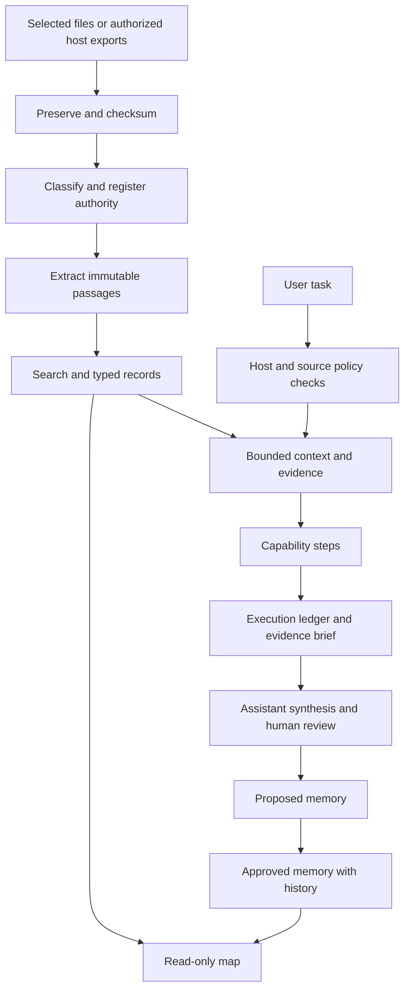

# Architecture

## Product and private workspace

The Git checkout holds source code, runtime skills, tests, documentation, and fictional examples. Setup creates a separate private directory. Never publish or push that private directory. Workspace `.gitignore` excludes all content by default.

| Subsystem                                | Canonical owner                      | Derived representation          |
| ---------------------------------------- | ------------------------------------ | ------------------------------- |
| Context                                  | Markdown frontmatter and content     | Bounded context response        |
| Memory                                   | Individual Markdown records          | Current approved view           |
| Policies, capabilities, models, taxonomy | YAML                                 | Validated command configuration |
| Sources, revisions, passages             | SQLite and immutable original bytes  | Full-text search                |
| Entities and relationships               | SQLite                               | Map nodes and edges             |
| Typed CSV rows                           | SQLite, scoped to immutable revision | Aggregate results               |
| Workflow state and approvals             | SQLite                               | Markdown evidence briefs        |
| Wiki pages and evidence                  | Markdown content plus SQLite index   | Cited current-view pages        |

Capability step tools, hosts, and connector providers are validated against runtime registries (`src/tools.ts`, `src/hosts.ts`, `src/connectors.ts`); built-ins self-register and new entries are registrations, not schema edits. Tool constraints are declared per tool and enforced at capability save, activation, and run. The database schema is version 2; version 1 workspaces open read-compatibly and migrate through `upgrade`, which takes a verified backup first. Wiki commands require schema 2.

The SQLite driver includes FTS5. Node's built-in SQLite is not used because its compiled features differ by Node release. Schemas validate external input; public object contracts live in `src/objects.ts`. Unsupported schema versions fail closed.

## Data flow

## Identity, authority and freshness

A source has a stable ID independent of its path. Use `--source-id` when moving or renaming an existing source. Host exports use provider + account hash + remote object ID. Content changes create a new revision; identical imports retain a separate occurrence without rebuilding ready passages. Each revision records its original metadata snapshot. Current access restrictions also govern old revisions.

The original import is preserved even when extraction fails. PDF/Office parsing runs in a bounded child process. Archive-size limits, symlink exclusions, credential exclusions, and path checks constrain intake. Originals are immutable by application convention, not protected against the machine's owner editing files directly.

Source authority and status are explicitly assigned. Filename classification and LLM interpretation never establish authority alone. “Latest” prefers signed/approved status, then a known effective date; unknown dates stay unknown. Import dates are recorded separately.

Entities are explicitly declared or reviewed. Matching names do not merge people. Strong identities and aliases are supported. Source-derived relationship claims require review and evidence before being registered as supported. Graph edges come from metadata, registered relationships, memory evidence, and capability definitions; none are generated for decoration.

## Governance

The default policy permits reading and local drafting, requires reviewable approval for organization, denies external mutation, and excludes restricted sources from every host until configured. Source and memory host allowlists are applied before returning context or evidence.

Approvals bind the exact action hash and current policy. Workflow approvals additionally bind input, capability, source state and context. A consumed approval cannot authorize another run. Document instructions cannot edit policy through the ingestion pipeline.

Approval records attest to a local operator's command. They are not cryptographic proof of human identity. An assistant with unrestricted shell access can directly edit local files; use runtime permissions for that boundary.

## Workflows and learning

The registered deterministic tools are context, retrieve, and meeting-brief. Generated capabilities cannot execute arbitrary shell or external actions. They begin in draft, require labeled source-retrieval evaluations, and must be explicitly activated. The bundled meeting-prep capability is covered by the shipped tests.

Runs persist each completed step. Retries resume explicitly by execution ID; they do not repeat successful deterministic steps. Changed input, host, capability, policy, context or sources invalidate resume. Missing evidence produces needs-review. Model costs are unknown because inference occurs in the host; the ledger never invents cost or model attribution.

Memory capture creates proposals. Review promotes or rejects them. Superseded content and prior file versions remain available. Context excludes stale source-backed, expired, future-effective and superseded memories. Quote checks prove source-text presence, not entailment. Consolidation reports candidates without silently merging them.

## Map boundary

The map is an optional React/Three.js client. Its read-only server binds 127.0.0.1 and requires an ephemeral bearer token for data. It checks Host and Origin, blocks mutations, and serves only built assets plus permitted record endpoints. Original files are served as downloads. The map never needs third-party CDNs.

Temporal filtering uses effective dates. It does not reconstruct prior database snapshots or invent chronology for undated records. The list provides access when WebGL is unavailable or motion is undesirable.
