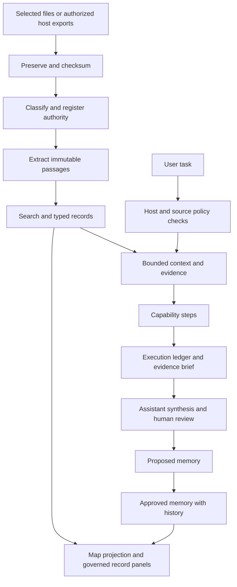

# Architecture

Current unreleased app architecture. The published skills-only package and historical app releases have separate compatibility. See [governance](RULES.md), [filesystem ownership](FILESYSTEM.md), [tool conventions](TOOL_CONVENTIONS.md) and [generated operations](OPERATIONS_REFERENCE.md).

## Product and private workspace

The Git checkout holds source code, runtime skills, tests, documentation, and fictional examples. Setup creates a separate private directory. Never publish or push that private directory. Workspace `.gitignore` excludes all content by default.

| Subsystem                                | Canonical owner                      | Derived representation          |
| ---------------------------------------- | ------------------------------------ | ------------------------------- |
| Context                                  | Markdown frontmatter and content     | Bounded context response        |
| Memory                                   | Individual Markdown records          | Current approved view           |
| Policies, capabilities, models, taxonomy | YAML                                 | Validated command configuration |
| Sources, revisions, passages             | SQLite and immutable original bytes  | Full-text search                |
| Entities and relationships               | SQLite                               | Map nodes and edges             |
| Typed CSV rows                           | SQLite, scoped to immutable revision | Aggregate results               |
| Workflow state and approvals             | SQLite                               | Markdown evidence briefs        |
| Wiki pages and evidence                  | Markdown content plus SQLite index   | Cited current-view pages        |

Capability step tools, hosts, and connector providers are validated against runtime registries (`src/tools.ts`, `src/hosts.ts`, `src/connectors.ts`); built-ins self-register and new entries are registrations, not schema edits. Tool constraints are declared per tool and enforced at capability save, activation, and run. Current schema, supported upgrade versions and engine API are generated in [Compatibility](COMPATIBILITY.md). Upgrades are sequential and require a verified backup and separate restore rehearsal. Wiki commands require schema 2; Projects & Tasks require schema 3; normalized intake requires schema 4. See [Batch 1](CHIEF_OF_STAFF_BATCH_1.md) for operational records, review contracts and recovery.

The SQLite driver includes FTS5. Node's built-in SQLite is not used because its compiled features differ by Node release. Schemas validate external input; public object contracts live in `src/objects.ts`. Unsupported schema versions fail closed.

## Data flow

```mermaid
flowchart TD
  A[Selected files or authorized host exports] --> B[Preserve and checksum]
  B --> C[Classify and register authority]
  C --> D[Extract immutable passages]
  D --> E[Search and typed records]
  F[User task] --> G[Host and source policy checks]
  G --> H[Bounded context and evidence]
  E --> H
  H --> I[Capability steps]
  I --> J[Execution ledger and evidence brief]
  J --> K[Assistant synthesis and human review]
  K --> L[Proposed memory]
  L --> M[Approved memory with history]
  E --> N[Map projection and governed record panels]
  M --> N
```

## Identity, authority and freshness

A source has a stable ID independent of its path. Use `--source-id` when moving or renaming an existing source. Host exports use provider + account hash + remote object ID. Content changes create a new revision; identical imports retain a separate occurrence without rebuilding ready passages. Each revision records its original metadata snapshot. Current access restrictions also govern old revisions.

The original import is preserved even when extraction fails. PDF/Office parsing runs in a bounded child process. Archive-size limits, symlink exclusions, credential exclusions, and path checks constrain intake. Originals are immutable by application convention, not protected against the machine's owner editing files directly.

Source authority and status are explicitly assigned. Filename classification and LLM interpretation never establish authority alone. “Latest” prefers signed/approved status, then a known effective date; unknown dates stay unknown. Import dates are recorded separately.

Entities are explicitly declared or reviewed. Matching names do not merge people. Strong identities and aliases are supported. Source-derived relationship claims require review and evidence before being registered as supported. Graph edges come from metadata, registered relationships, memory evidence, and capability definitions; none are generated for decoration.

## Governance

The default policy permits reading and local drafting, requires reviewable approval for organization, denies external mutation, and excludes restricted sources from every host until configured. Source and memory host allowlists are applied before returning context or evidence.

Approvals bind the exact action hash and current policy. Workflow approvals additionally bind input, capability, source state and context. A consumed approval cannot authorize another run. Document instructions cannot edit policy through the ingestion pipeline.

Approval records attest to a local operator's command. They are not cryptographic proof of human identity. An assistant with unrestricted shell access can directly edit local files; use runtime permissions for that boundary.

## Workflows and learning

The registered deterministic tools are context, retrieve, and meeting-brief. Generated capabilities cannot execute arbitrary shell or external actions. They begin in draft, require labeled source-retrieval evaluations, and must be explicitly activated. The bundled meeting-prep capability is covered by the shipped tests.

Runs persist each completed step. Retries resume explicitly by execution ID; they do not repeat successful deterministic steps. Changed input, host, capability, policy, context or sources invalidate resume. Missing evidence produces needs-review. Optional in-app OpenAI/Anthropic generation records usage and reservations under explicit disclosure and budget controls. Host handoff remains available; its external inference cost is unknown to HOI. The ledger distinguishes estimates, returned usage and uncertain dispatches.

Memory capture creates proposals. Review promotes or rejects them. Superseded content and prior file versions remain available. Context excludes stale source-backed, expired, future-effective and superseded memories. Quote checks prove source-text presence, not entailment. Consolidation reports candidates without silently merging them.

## Map boundary

The map is an optional React/Three.js client integrated into Knowledge Hub, with node actions opening permission-filtered records and wiki draft/compare/publish workflows. Its standalone map server remains read-only. Local servers bind 127.0.0.1, authenticate requests and enforce Host/Origin rules. The full app routes mutations through governed engine operations; map proximity grants no relationship or permission. Original files use controlled downloads. The map needs no third-party CDN.

Temporal filtering uses effective dates. It does not reconstruct prior database snapshots or invent chronology for undated records. The list provides access when WebGL is unavailable or motion is undesirable.

Normalized work intake preserves selected exports and immutable source revisions, then checkpoints a bounded assistant request. Structured submissions are validated against current, permitted, non-quoted evidence. Matching is scoped to project and recurrence, with human review of possible duplicates. Decisions, task updates and evidence attachment are transactional with version checks; undo refuses later edits. Derived task visibility includes decision history, including reversed changes. See [Batch 2](CHIEF_OF_STAFF_BATCH_2.md).

Batch 3 adds read-only daily-work projections over schema 4. Optional explicit calendar timing is preserved in intake originals; no schema migration is needed. Availability is an explicitly supplied, recent full-window snapshot, never inferred from a partial set of events. Date-only deadlines remain dates; timed calculations use IANA zones and reject ambiguous/nonexistent wall-time boundaries. Meeting context shares project task/memory operations with the existing workflow runner, whose resume digest includes operational context. See [Batch 3](CHIEF_OF_STAFF_BATCH_3.md).

Batch 4 adds schema-5 knowledge review records and retirement dispositions. Dispositions exclude records from active knowledge views without deleting Markdown originals. Findings and exact review decisions are stored transactionally; reviewed fingerprints suppress unchanged findings. Wiki/memory drafts remain reviewed through their existing flows. Source evidence permissions govern both current views and review history. Task map projections use persisted task/project/evidence records. See [Batch 4](CHIEF_OF_STAFF_BATCH_4.md).

Batch 5 stores project-scoped assistant-handoff runs in schema-6 chat_runs. Registered typed read tools, current-evidence citation validation, context fingerprints, cancellation and task review cards share the core with the app. Authenticated server-sent events carry validated run updates, not live model tokens. Embedded inference and automated web search are not configured, per the user decision. See [Batch 5](CHIEF_OF_STAFF_BATCH_5.md).

Batch 6 adds immutable calendar proposals and exact reviews in schema-7 `calendar_actions`. Google Calendar writes are opt-in per concrete calendar ID, with process-only OAuth credentials. Uncertain sends reconcile using persisted deterministic event IDs and never retry a missing event automatically. See [Batch 6](CHIEF_OF_STAFF_BATCH_6.md).

The workspace redesign adds source lifecycle and upload jobs (8), editable clients/projects/trainings and review history (9), and scoped read-only connection jobs, OS credential references, item checkpoints and assistant processing (10). See [workspace redesign](WORKSPACE_REDESIGN.md).

Schema 11 adds durable file jobs, source locations, sync outcomes/checkpoints, knowledge dates and reviewable entity redirects. See [Batch C](ENGINE_BATCH_C.md) for recovery and provider boundaries. File preservation and text extraction use a reusable worker; database ownership stays in the engine.

Schema 12 adds host-scoped saved views, workspace timezone preferences and revision-bound assistant-processing requests. Dashboard projections use explicit coverage and exact record destinations. See [Batch D](ENGINE_BATCH_D.md) and the [current completion plan](COMPLETION_PLAN.md).

## Current operational layer

The engine owns workspace writes and durable jobs; CLI and optional adapters connect to it while it runs. Conversations, bounded provider tools, proposals, exact-action Google drafts/preparation events and Activity use the shared registry. Schema 18 retains ordered progress and validated result links; see [interactive work](INTERACTIVE_WORK.md). Provider credentials use OS secure storage and are excluded from exports. Live-provider and clean-machine verification remain separate gates.

Installed guides are checksummed documentation, not policies. Managed workspace manuals link to their content-versioned bundle. Missing or modified guide metadata is reported separately from runtime availability.
