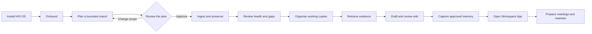
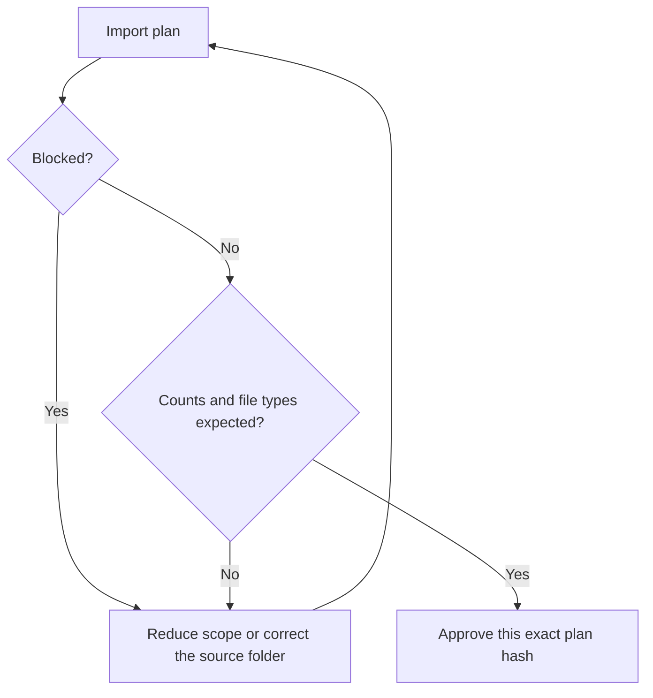
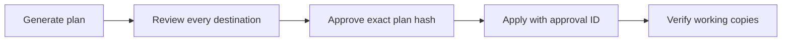
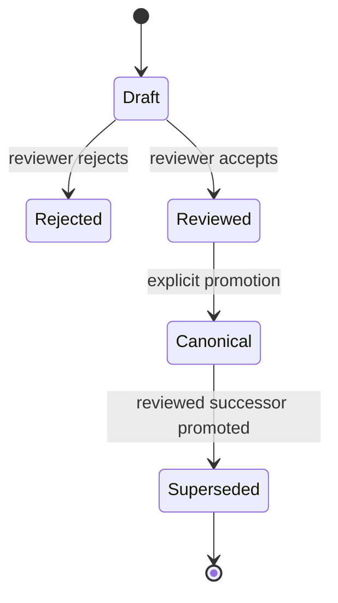

# HOI OS user SOP

Standard operating procedure for installing, onboarding, ingesting sources, organising working files, building a cited wiki and second brain, and opening the local Workspace App.

> HOI OS keeps the product checkout separate from the private workspace. Never publish the private workspace, originals, backups, exports or credentials.

## The operating flow



The app is installed with HOI OS. It becomes useful as the private workspace gains reviewed sources, wiki pages, entities and memory. HOI OS does not generate a separate software product for every user.

## Before you start

You need:

- macOS or Windows;
- Git;
- Node.js 22.14 or later;
- local Codex or Claude Code access;
- a product directory;
- a separate empty private-workspace directory;
- enough private storage for originals, the database and backups.

Use one host name consistently:

| Assistant   | Skill invocation | CLI host        |
| ----------- | ---------------- | --------------- |
| Codex       | `$hoi-onboard`   | `--host codex`  |
| Claude Code | `/hoi-onboard`   | `--host claude` |

The examples use these placeholders:

```text
PRODUCT = path to the hoi-os checkout
WORKSPACE = path to the private HOI OS workspace
SOURCES = the selected source folder outside WORKSPACE
BACKUP = a new private backup directory outside WORKSPACE
```

## 1. Install

Use `hoi-install` or follow the version-pinned installation instructions in the repository README.

After installation, verify the workspace:

```sh
node "PRODUCT/bin/hoi.mjs" doctor \
  --workspace "WORKSPACE" \
  --host codex \
  --json
```

Replace `codex` with `claude` when appropriate.

Continue only when the database is available and the intended adapter is present. A new empty workspace may report that no backup exists. Take a backup before importing valuable information.

## 2. Onboard

Open the private workspace in the chosen assistant and invoke `hoi-onboard`.

Confirm:

- who the workspace serves;
- the organisation and role;
- the first useful outcome;
- recurring work;
- restrictions and sensitive source classes;
- the selected source folder;
- whether its existing structure should be retained.

Onboarding must not scan or import an entire computer. Start with one selected folder or a bounded pilot containing 50–150 files.

## 3. Plan the import

Planning is read-only. It reports the selection, bytes, file types, known existing locations, limits and warnings without importing content.

```sh
node "PRODUCT/bin/hoi.mjs" ingest-plan "SOURCES" \
  --workspace "WORKSPACE" \
  --host codex \
  --max-files 150 \
  --max-bytes 1073741824 \
  --json
```

Review:

- `fileCount` and `totalBytes`;
- file types;
- `existingLocations`;
- the maximum file and byte limits;
- `warnings`;
- `blocked`;
- `planHash`.



Never approve:

- a home directory or disk root;
- credential or secrets folders;
- an unexplained source count;
- a selection larger than available storage can support;
- a plan whose warnings are not understood.

## 4. Ingest and preserve

Pass the exact reviewed plan hash and the same limits:

```sh
node "PRODUCT/bin/hoi.mjs" ingest "SOURCES" \
  --workspace "WORKSPACE" \
  --host codex \
  --plan-hash "PLAN_HASH" \
  --max-files 150 \
  --max-bytes 1073741824 \
  --json
```

If the directory changes after planning, HOI OS rejects the stale plan. Run `ingest-plan` again.

Review the outcome counts. Failed extraction does not delete the preserved original. Do not retry every failure blindly.

For one explicitly selected file, a directory plan is not required:

```sh
node "PRODUCT/bin/hoi.mjs" ingest "SOURCE_FILE" \
  --workspace "WORKSPACE" \
  --host codex \
  --metadata "METADATA_FILE" \
  --json
```

## 5. Check workspace health

```sh
node "PRODUCT/bin/hoi.mjs" health \
  --workspace "WORKSPACE" \
  --host codex \
  --json
```

Health reports privacy-safe aggregates:

- workspace and current schema versions;
- database size;
- source, revision, passage and occurrence counts;
- revision outcomes;
- workflow, evaluation and approval counts;
- database, extraction, lock, adapter and backup checks.

Investigate unexpected database growth, non-ready revisions, old or invalid backups, and schema mismatches before adding more sources.

## 6. Organise working copies

Invoke `hoi-organize`. It proposes working-copy destinations and never moves originals.



If the plan or policy changes, generate and approve a new plan. A prior approval does not cover altered destinations.

## 7. Retrieve evidence

Invoke `hoi-retrieve` or use the CLI:

```sh
node "PRODUCT/bin/hoi.mjs" retrieve "QUESTION" \
  --workspace "WORKSPACE" \
  --host codex \
  --latest \
  --json
```

Use client/project filters where relevant. Preserve source, revision and passage IDs. Distinguish source facts, approved memory and assistant inference. Missing evidence remains a visible gap.

## 8. Build the wiki

Wiki pages require schema 2. If the workspace reports schema 1, stop and follow the backup-first upgrade procedure in `docs/OPERATIONS.md`.

Invoke `hoi-wiki`:

1. Retrieve permitted evidence.
2. Draft one page for one subject.
3. Propose the page with cited passages.
4. Review the draft.
5. Mark it reviewed or rejected.
6. Promote only a reviewed page to canonical.



A wiki page is a current view, not original evidence. Corrections create successors; they do not erase prior pages.

## 9. Build the second brain

The second brain consists of several reviewed layers:

| Layer                      | What it contains                                | How it changes                            |
| -------------------------- | ----------------------------------------------- | ----------------------------------------- |
| Originals and revisions    | Preserved source records                        | New immutable revision                    |
| Evidence passages          | Searchable source excerpts                      | Reindex from preserved revisions          |
| Entities and relationships | Declared people, clients, projects and links    | Explicit creation and reviewed evidence   |
| Wiki                       | Cited current views                             | Draft → review → canonical                |
| Memory                     | Confirmed decisions, preferences and experience | Proposal → review → approval or rejection |
| Execution records          | Capability inputs, checkpoints and outputs      | Appended by workflow runs                 |

Invoke `hoi-session-capture` after meaningful work. Confirm each proposed decision or preference. Assistant suggestions and unconfirmed options do not become memory.

Use `hoi-consolidate` to find proposed, stale or duplicate memory. It reports candidates; it does not silently merge them.

## 10. Open the Workspace App

```sh
node "PRODUCT/bin/hoi.mjs" app \
  --workspace "WORKSPACE" \
  --host codex \
  --port 0
```

Open the authenticated localhost URL printed by the command. Do not publish the URL or its token.

The app provides:

- source-backed search;
- entities and relationships;
- wiki review;
- sources and connection status;
- memory review;
- a link to the optional 3D knowledge map.

Stop the app with `Ctrl+C` before restore or migration work.

## 11. Prepare a meeting

Invoke `hoi-meeting-prep`.

Verify the exact event, timezone, participants, client and project. Calendar details must come from a fresh authorized read or be labeled user-supplied. The brief must preserve citations and state missing information. Confirm decisions after the meeting before capturing them.

## 12. Back up and maintain

Create backups in new private directories:

```sh
node "PRODUCT/bin/hoi.mjs" backup "BACKUP" \
  --workspace "WORKSPACE" \
  --host codex \
  --json
```

HOI OS backups contain private information and are not encrypted by the application. Protect them with the machine or storage provider's encryption.

Recommended rhythm:

| When                     | Action                                                                         |
| ------------------------ | ------------------------------------------------------------------------------ |
| Before a valuable import | Verify a recent backup and review the import plan                              |
| After an import          | Run health and review non-ready outcomes                                       |
| Before a meeting         | Refresh authorized connections and retrieve current evidence                   |
| After a meeting          | Capture only confirmed decisions                                               |
| Weekly                   | Review proposed/stale memory and wiki contradictions                           |
| Before an update         | Stop the app, take a new backup, rehearse material migrations on a copy        |
| Monthly                  | Verify one restore, review dependency/security status and run evaluation cases |

## Stop and ask for help when

- the database integrity check fails;
- the workspace schema is unsupported;
- a backup is invalid;
- a source plan changes unexpectedly;
- storage is insufficient;
- a lock belongs to a live or uncertain process;
- citations do not resolve;
- the intended account or event is ambiguous;
- a request requires an external write that HOI OS does not support.

## Completion checklist

- [ ] Product and private workspace are separate.
- [ ] The intended Codex or Claude adapter is present.
- [ ] Onboarding context is current.
- [ ] The import was planned and bounded.
- [ ] Originals were preserved and health was reviewed.
- [ ] Working copies were organised through an approved plan.
- [ ] Retrieval returns cited evidence or an explicit gap.
- [ ] Wiki pages passed review before promotion.
- [ ] Memory contains only confirmed information.
- [ ] The Workspace App opens locally with the correct workspace.
- [ ] A recent private backup verifies successfully.
